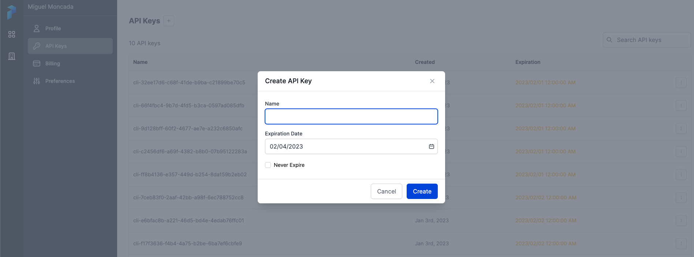
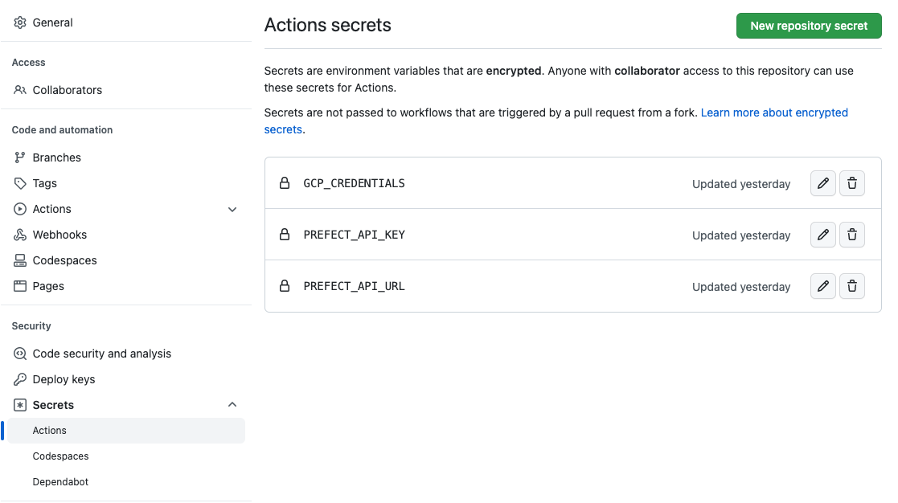
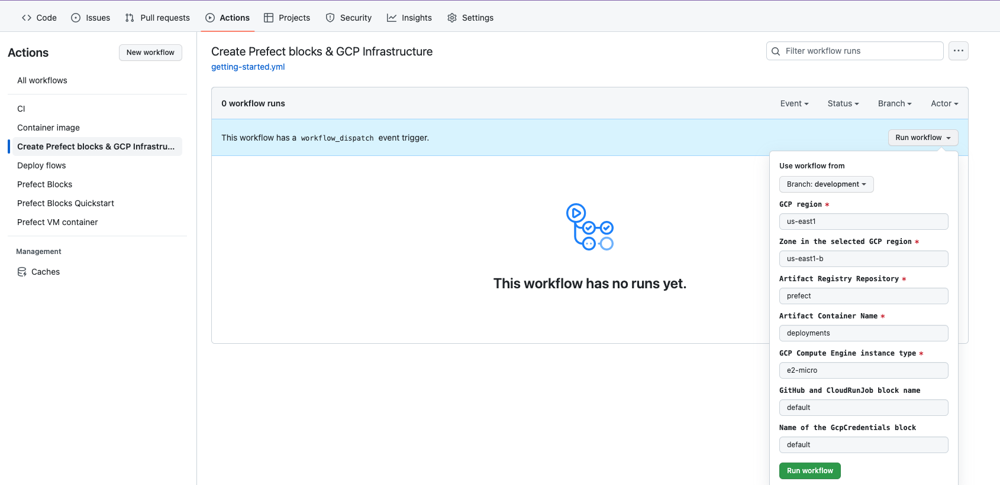
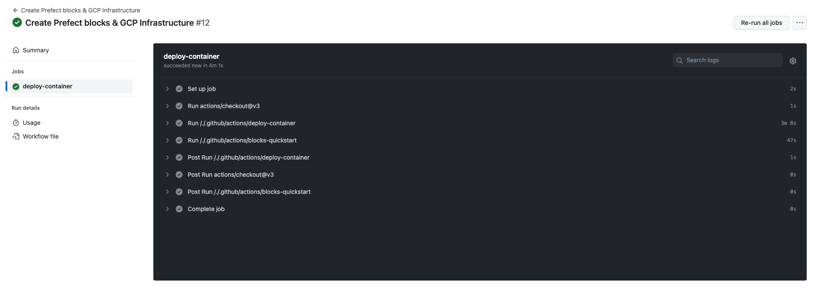

# Getting started with Prefect & GCP

This guide will walk you through the steps to get started with Prefect Cloud and Google Cloud Platform (GCP). We'll cover how to set up a GCP project, create a service account, and configure Prefect Cloud to use the service account. We'll also cover how to set up a GCP bucket and configure Prefect Cloud to use the bucket for storage.

>NOTE: This setup is based on the `prefect-cloud-gcp` template that can be found [here](https://github.com/anna-geller/prefect-cloud-gcp)

## Google Cloud Platform (GCP) items

- Google CLoud Platform (GCP) account
- Google Cloud Storage (GCS) bucket
- Google Cloud Service Account
- Google Cloud Artifact Registry
- Google Cloud Run containers
- Google Cloud Compute Engine VM

## Prefect Cloud items

- Prefect Cloud account (Orion)
- Prefect Block Storage (GCP Cloud Storage)
- Prefect Block Infrastructure (GCP Cloud Run)
- Prefect Cloud agent (deployed to GCP VM)

## Steps

### Prefect Cloud

1. Create a Prefect Cloud account following [this guide](https://docs.prefect.io/orion/core/getting_started/installation.html#sign-up-for-prefect-cloud)
2. Create a [Workspace](https://docs.prefect.io/orion/core/getting_started/installation.html#create-a-workspace) and an [API key](https://docs.prefect.io/orion/core/getting_started/installation.html#generate-an-api-key) from the user profile page.
   
3. Add both `PREFECT_API_KEY` and `PREFECT_API_URL` as [GitHub Actions secrets](https://docs.github.com/en/actions/security-guides/encrypted-secrets).

### Google Cloud

1. Create a [GCP project](https://cloud.google.com/resource-manager/docs/creating-managing-projects)
2. Install `gcloud` CLI tool and authenticate with your GCP account following [this guide](https://cloud.google.com/sdk/docs/install)
3. From Cloud Shell, run the following commands to create a service account and download the service account key file:

```bash
# Create GCP account + project => here we use project named "prefect-community" - replace it with your project name
# This will also set default project and region:
export CLOUDSDK_CORE_PROJECT="prefect-community"
export CLOUDSDK_COMPUTE_REGION=us-east1
export GCP_AR_REPO=prefect
export GCP_SA_NAME=prefect

# enable required GCP services:
gcloud services enable iamcredentials.googleapis.com
gcloud services enable artifactregistry.googleapis.com
gcloud services enable run.googleapis.com
gcloud services enable compute.googleapis.com

# create service account named e.g. prefect:
gcloud iam service-accounts create $GCP_SA_NAME
export MEMBER=serviceAccount:"$GCP_SA_NAME"@"$CLOUDSDK_CORE_PROJECT".iam.gserviceaccount.com
gcloud projects add-iam-policy-binding $CLOUDSDK_CORE_PROJECT --member=$MEMBER --role="roles/run.admin"
gcloud projects add-iam-policy-binding $CLOUDSDK_CORE_PROJECT --member=$MEMBER --role="roles/compute.instanceAdmin.v1"
gcloud projects add-iam-policy-binding $CLOUDSDK_CORE_PROJECT --member=$MEMBER --role="roles/artifactregistry.admin"
gcloud projects add-iam-policy-binding $CLOUDSDK_CORE_PROJECT --member=$MEMBER --role="roles/iam.serviceAccountUser"

# create JSON credentials file as follows, then copy-paste its content into your GHA Secret + Prefect GcpCredentials block:
gcloud iam service-accounts keys create prefect.json --iam-account="$GCP_SA_NAME"@"$CLOUDSDK_CORE_PROJECT".iam.gserviceaccount.com
```

This will generate the JSON key file, of which contents you can copy and paste into your `GCP_CREDENTIALS` secret in:

- GitHub Action secret named `GCP_CREDENTIALS`
- Prefect `GcpCredentials` block named `default`

>**NOTE**: if you save this Prefect block with a different name, make sure to adjust it in your GitHub >Action inputs, e.g. in `.github/workflows/getting-started.yml`:
>
>```yml
>    gcp_creds_block_name:
>        description: 'Name of the GcpCredentials block'
>        required: false
>        default: "default"
>       type: string
>```



### GitHub Actions

1. From the GitHub Actions tab, click on the `Create Prefect blocks & GCP Infrastructure` workflow and click on `Run workflow`:
   

This will perform the following actions:

- Create a Prefect Block Storage named `default` using GCS and a Prefect Block Infrastructure using Cloud Run named `default`

- Create a VM in GCP Compute Engine named `prefect-cloud-vm` and install Prefect Cloud agent on it through a Docker container that uses an artifact built using [this `Dockerfile`](../Dockerfile) with a schedule attached to it so it starts and stops at a certain time every weekday (by default 8am-5pm UTC)

    >**NOTE**: You can check the output of an example successful workflow run [here](/assets/setup_logs)

1. Check the logs to see if the workflow succeeded. If it did, you should see the following output:
   
